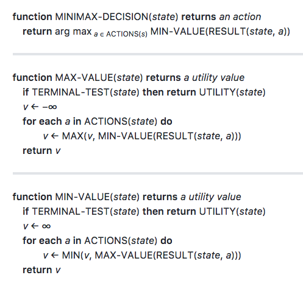

# udacity-ai

Udacity AI - an introduction to AI.

## Curriculum

* Constrain satisfaction problem
  * Backtracking search
  * CSP solver
    * Microsoft Research Z3 solver
    * Google OR Tools
* Classical search
  * Uninformed search
    * Breadth first search
    * Depth first search
    * ~Uniform cost search
  * Informed search
    * ~Greedy best-first search
    * A* search
* Automated planning
  * Symbolic logic & reasoning
    * Propositional logic
    * First order logic
  * Classical planning
    * Air cargo problem
* Optimization problems (gradient-free)
  * Hill climbing
  * Simulated annealing
  * Genetic algorithm
* Adversarial search
  * Minimax algorithm
  * Alpha-beta pruning
  * Evalution functions
  * Isolation game player
  * Multi-player probabilistic games
  * Monte Carlo Tree Search
    * AlphaGo, AlphaZero
* Probabilistic models
  * Probability theory
  * Naive Bayes
    * Spam email classifier
  * Bayes Nets
  * Hidden Markov models
    * Speech tagging
* What is next?
  * Learning from examples
    * Machine learning 
    * Deep learning
    * Deep reinforcement learning

## Appendix
### Minimax
